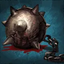

# 333 Шакрамы ✨

<div class="build-card-row" markdown>
<div class="build-card" markdown>

<!-- Difficulty/Trixion/Playstyle stats above, AND the pentagon badge below,
     both read from javascripts/build-data.js (window.DB_BUILD_DATA) - there is
     nothing to hand-edit in either div itself. Find this build by its
     data-build id there and edit pentagon/difficulty/trixion/bestFor/etc.;
     the stat row, the pentagon badge, and the essentials.md comparison table
     all update together from that one place. -->
<div class="build-stats" data-build="333-ceiling" data-family="re"></div>

**Кому подходит:**{: .best-для } Тем, кто хочет максимальный урон в Остаточной энергии.

- Использует «Воздушные шакрамы» как два быстрых каста (<span class="skill-mention" data-glossary-id="ftfcombo">FTF</span> комбо) через сброс скилла.
- «Хитроумный финт» всегда свободен для контр-скиллов, восстановления, очищения или <span class="skill-mention" data-skill-id="adrenaline">Адреналин</span> поддержания.
- Высокая эффективность самоцветов: «Воздушные шакрамы» и «Убийственная сталь» — основа твоего урона.

</div>
<div class="pentagon-badge" data-build="333-ceiling" data-family="re" markdown>
<div class="pentagon-badge-title">Профиль билда</div>
<div class="pentagon-svg-mount"></div>
<div class="pentagon-badge-extra" markdown>
[Видео-гайд](https://youtu.be/Wwm7apTwg84?si=dmO_fvNxoXuoQuf5){ .video-chip } [Геймплей](https://www.youtube.com/watch?v=MP--TuRX3xI){ .video-chip }
</div>
</div>
</div>

## Код билда {#skill-codes}

<!-- Paste the exported skill-code string (from the in-game loadout share
     feature) into the fenced code block below. Each `=== "Tab Name"` block is
     a separate tab holding its own code + optional italic note above it -
     copy that pattern to add another import option (e.g. an easier variant). -->

<div class="setup-panel" data-accent="lavender" markdown>
<div class="setup-notes" markdown>

<details class="setup-note" data-kind="danger" open markdown>
<summary><span class="setup-note-tag">Внимание</span>Перед импортом<span class="setup-note-arrow"></span></summary>

Убедись, что прочитал [Основы](essentials.md) перед импортом! Самоцветы сравни с гайдом ([Самоцветы](#gems)).

</details>

</div>
</div>

=== "333 Шакрамы ★"

    ```
    B8D439DF1CD065F57B13617B183389592A0CC33220F6BE9E73BB5DE3436975884F075C0D62505EC34A6E8134B428C59E34EF8CAE65BB121AB97300D34C3BC542
    ```

## Система А.Р.К. {#ark-setup}

<!-- ark-passives / ark-cores JSON below use the site-wide node/core id
     vocabulary - each ark-passives node only needs its id + invested level,
     tier/max/name/icon all resolve from ap-node-names.js. Full schema is
     documented in javascripts/ark-passive-tree.js and ark-core-badge.js's
     "EASY EDIT GUIDE" comments. A nested "Alt" details block (e.g. an
     easier/optional variant) can carry its own compact ark-passives/
     skill-setup pair for that alternative - copy the existing pattern
     rather than editing the main tree in place. -->

<div class="setup-panel" data-accent="lavender" markdown>

<div class="ark-passives" data-family="re" markdown>
<script type="application/json">
[
    { "id": "evolution", "nodes": [
      { "id": "crit", "level": 10 },
      { "id": "specialization", "level": 30 },
      { "id": "keensense", "level": 1 },
      { "id": "limitbreakevo", "level": 2 },
      { "id": "strike", "level": 2 },
      { "id": "master", "level": 1 },
      { "id": "pulverize", "level": 1 },
      { "id": "standingstriker", "level": 2 }
    ] },
    { "id": "enlightenment", "nodes": [
      { "id": "swiftstrike", "level": 1 },
      { "id": "remainingenergy", "level": 3 },
      { "id": "firmwill", "level": 3 },
      { "id": "extremebodymovement", "level": 3 },
      { "id": "orbcirculation", "level": 2 }
    ] },
    { "id": "leap", "nodes": [
      { "id": "unleashedpower", "level": 5 },
      { "id": "releasepotential", "level": 4 },
      { "id": "instantspell", "level": 2 },
      { "id": "danceofnightmares", "level": 3 }
    ] }
  ]
</script>
</div>

<div class="ark-cores" data-family="re" markdown>
<script type="application/json">
[
  { "core": "sun", "label": "Levin Slash", "points": 3 },
  { "core": "moon", "label": "Deathblade Wave", "points": 3 },
  { "core": "star", "label": "Death Sword Energy", "points": 2 }
]
</script>
</div>

<div class="setup-notes" markdown>

<details class="setup-note" data-kind="tip" open markdown>
<summary><span class="setup-note-tag">Советы</span>Советы по А.Р.К.<span class="setup-note-arrow"></span></summary>

- Используй [Калькулятор Созвездий А.Р.К.](../resources.md#ark-passive-calculator), чтобы оптимизировать вкладку «Экспансию».
- <span class="skill-mention" data-ap-id="releasepotential" data-level="3">Стремительное восстановление 3</span> / <span class="skill-mention" data-ap-id="instantspell" data-level="3">Божественное вдохновение 3</span> / <span class="skill-mention" data-ap-id="awakeningamplifier" data-level="1">Пробужденное сознание 1</span> может решить проблемы с маной ценой совсем небольшой потери урона.

</details>

<details class="setup-note" data-kind="note" markdown>
<summary><span class="setup-note-tag">Заметка</span><span class="skill-mention" data-glossary-id="arkgrid">Созвездия А.Р.К.</span><span class="setup-note-arrow"></span></summary>

- Добирай «Энергию меча смерти» до 17p, когда получается: «Воздушные шакрамы» — твой скилл с наибольшим уроном.

</details>

<details class="setup-note" data-kind="example" markdown>
<summary><span class="setup-note-tag">Альтернатива</span><span class="skill-mention" data-ap-id="orbcirculation" data-level="5">Циркуляция энергии 5</span><span class="setup-note-arrow"></span></summary>

- Делает билд прощающим ценой примерно 3% урона за счёт роста пассивной генерации сфер.

<div class="skill-setup" data-family="re" markdown>
<script type="application/json">
[
  {"id": "soulabsorber", "level": 14, "rune": {"tier": "legendary", "name": "Wealth"}}
]
</script>
</div>

<div class="ark-passives ark-passives-compact" data-family="re" markdown>
<script type="application/json">
[
  { "id": "enlightenment", "nodes": [
    { "id": "swiftstrike", "level": 1 },
    { "id": "remainingenergy", "level": 3 },
    { "id": "firmwill", "level": 3 },
    { "id": "swordcraftenhancement", "level": 1 },
    { "id": "extremebodymovement", "level": 2 },
    { "id": "orbcirculation", "level": 5 }
  ] }
]
</script>
</div>

</details>

<details class="setup-note" data-kind="example" markdown>
<summary><span class="setup-note-tag">Альтернатива</span>NA/EU 333 Стандарт<span class="setup-note-arrow"></span></summary>

- Альтернатива, старающаяся сохранить похожий стиль игры на «Стандарт» ОС, с «Разрубающими лезвиями» и лишней маной.
    - Это улучшение относительно «Стандарта» ОС, но стиль игры несовместим с современной ОС и уступает по урону.
    - Рекомендуется, если другие билды не получаются или ты предпочитаешь привычную игру по старым билдам.
    - Его гайд и вся связанная информация ведутся [здесь](https://docs.google.com/document/d/1vs1YC_7adaYwtfN9cHO3x2KuMPq6GcKRlGo5vnsN4Lk/edit); здесь он не размещён и не поддерживается.

</details>

</div>

</div>

## Гравировки {#engravings}

<div class="setup-panel" data-accent="lavender" markdown>

<div class="engraving-loadout engraving-loadout-fixed" markdown>
<span class="engraving-chip" data-skill-id="grudge">Титаноборец</span>
<span class="engraving-chip" data-skill-id="adrenaline">Адреналин</span>
<span class="engraving-chip" data-skill-id="ambushmaster">Бесшумный убийца</span>
<span class="engraving-chip" data-skill-id="raidcaptain">Неутомимый натиск</span>
<span class="engraving-chip" data-skill-id="keenbluntweapon">Моргенштерн</span>
</div>

<p class="engraving-loadout-hint engraving-loadout-hint-line" markdown>Подробнее о гравировках можно прочитать [здесь!](essentials.md#engravings)</p>

</div>

## Набор навыков {#skill-setup}

<!-- Full skill-setup schema (id/level/tripods/rune/subtitle/picks) is in
     javascripts/skill-setup.js's "EASY EDIT GUIDE" comment. Names, icons, and
     tags resolve automatically by id from skill-data.js - only add "name" to
     override the display text for a genuine one-off case. -->

<div class="setup-panel" data-accent="lavender" markdown>

<div class="skill-setup" data-family="re" markdown>
<script type="application/json">
[
  {"id": "soulabsorber", "level": 14, "tripods": [3, 1, 2], "rune": {"tier": "epic", "name": "Wealth"}},
  {"id": "twinshadows", "level": 14, "tripods": [2, 1, 2], "rune": {"tier": "epic", "name": "Wealth"}},
  {"id": "headhunt", "level": 1, "rune": {"tier": "uncommon", "name": "Wealth"}},
  {"id": "turningslash", "level": 14, "tripods": [1, 3, 1], "rune": {"tier": "rare", "name": "Wealth"}},
  {"id": "maelstrom", "level": 10, "tripods": [2, 1, 2], "rune": {"tier": "rare", "name": "Wealth"}},
  {"id": "fatalwave", "level": 14, "tripods": [2, 3, 2], "rune": {"tier": "legendary", "name": "Galewind"}},
  {"id": "blitzrush", "level": 14, "tripods": [2, 1, 1], "rune": {"tier": "rare", "name": "Wealth"}},
  {"id": "voidstrike", "level": 14, "tripods": [3, 1, 2], "rune": {"tier": "legendary", "name": "Wealth"}},
  {"id": "surge", "subtitle": "Identity"},
  {"id": "deathlyslash", "subtitle": "Technique"},
  {"id": "bladeassault", "subtitle": "Awakening"}
]
</script>
</div>

<div class="setup-notes" markdown>

<details class="setup-note" data-kind="tip" open markdown>
<summary><span class="setup-note-tag">Советы</span>Руны<span class="setup-note-arrow"></span></summary>

- Используй <span class="skill-mention" data-rune-name="Focus" data-rune-tier="legendary">Легендарный Марх</span> на «Плаще клинков», если проблемы с маной, или используй <span class="skill-mention" data-rune-name="Purify">Солум</span> на «Хитроумном финте», что бы снять негативный эффект.

</details>

<details class="setup-note" data-kind="note" open markdown>
<summary><span class="setup-note-tag">Заметка</span>Опции и триподы<span class="setup-note-arrow"></span></summary>

- Можно поднять «Хитроумный финт» до Ур. 7
- На первом уровне триподов можно выбрать сокращение перезарядки («Быстрая подготовка»), а так же можно снизить расход маны («Сосредоточение»)
- На втором уровне можно выбрать трипод «Подсечка» и умение начнет применяться мгновенно и без рывка

</details>

</div>

</div>

## Самоцветы {#gems}

<!-- Ranked skill-id lists per column (dmg/cd), top = highest priority.
     Full schema, including the expandable "alts" form for a swappable
     alternative, is in javascripts/gem-priority.js's "EASY EDIT GUIDE"
     comment. -->

<div class="setup-panel" data-accent="lavender" markdown>

<div class="gem-priority" markdown>
<script type="application/json">
[
  { "col": "dmg", "items": [
    { "id": "fatalwave", "level": 10 }, "surge", "twinshadows", "soulabsorber",
    "turningslash", "voidstrike", "blitzrush"
  ] },
  { "col": "cd", "items": [
    "maelstrom", "blitzrush", "turningslash", "fatalwave"
  ] }
]
</script>
</div>

</div>

## Ротация {#rotation}

<!-- Each `.rotation-line` is a compact JSON step list of skill ids in
     order - names/icons resolve automatically, same id vocabulary as Skill
     Setup and Gems above. Full schema (situational steps, swapNext,
     cycleRef, trailing suffix, etc.) is in javascripts/rotation-line.js's
     "EASY EDIT GUIDE" comment. -->

Используй **Открытие** (по желанию), затем чередуй **Цикл 1** и **2** до конца боя. Открытие набирает стаки «Адреналина» и навешивает синергии.

Открытие с 3 сфер (<span class="food-req-item">{: .skill-icon } Мощная «Эйфория»</span>)
{ .rotation-stage }

<div class="rotation-line" markdown>
<script type="application/json">
[{ "id": "headhunt", "swapNext": true }, "twinshadows", "maelstrom", "turningslash", "deathlyslash", "fatalwave", "surge",
 { "cycleRef": 2, "title": "Цикл «Длани Авесты» + «Охоты за головами»" },
 { "cycleRef": 1, "title": "Цикл «Искусства меча» + «Убийственной стали»" },
 { "suffix": "и так далее" }]
</script>
</div>

Чередующиеся циклы
{ .rotation-stage }

<div class="cycle-card" markdown>
<div class="cycle-card-header"><span class="cycle-num cycle-num-1">1</span><span class="cycle-title">Цикл «Искусства меча» + «Убийственной стали»</span></div>
<div class="rotation-line" markdown>
<script type="application/json">
["maelstrom", "voidstrike", "twinshadows", "deathlyslash", "fatalwave", "turningslash", "fatalwave", "surge"]
</script>
</div>
</div>

<div class="cycle-card" markdown>
<div class="cycle-card-header"><span class="cycle-num cycle-num-2">2</span><span class="cycle-title">Цикл «Длани Авесты» + «Охоты за головами»</span></div>
<div class="rotation-line" markdown>
<script type="application/json">
["soulabsorber", "blitzrush", "twinshadows",
 { "id": "maelstrom", "situational": "восстановление" },
 "fatalwave", "turningslash", "fatalwave", "surge"]
</script>
</div>
</div>

<div class="rotation-notes" markdown>

1. Старайся уместить «Двойную плеть» из **Цикла 2** под «Плащ клинков» из **Цикла 1**, чтобы набрать 3 сферы без повторного применения или восстановления. Если дошёл только до «Длани Авесты», обычно хватает одного дополнительного применения «Хитроумного финта».
2. «Плащ клинков» в **Цикле 2** применяется, только если иначе не хватит 3 сфер. Решай сам. Если применил, он действует минимум до «Искусства меча» в **Цикле 1**; повторное применение на истечении перезарядки синхронизирует их. Если он не был нужен или не дожил, ничего не меняется.

</div>

<aside class="setup-note" data-kind="danger" markdown>
<p><span class="setup-note-tag">Важно</span> Если у тебя что-то пошло в ротации не так, ты можешь поменять местами <span class="skill-mention" data-skill-id="soulabsorber">Длань Авесты</span> и <span class="skill-mention" data-skill-id="voidstrike">Искусство меча</span>, если это поможет.</p>
</aside>

<div class="rotation-notes" markdown>

- <span class="skill-mention" data-skill-id="soulabsorber">Длань Авесты</span> + <span class="skill-mention" data-skill-id="deathlyslash">Убийственная сталь</span>
- <span class="skill-mention" data-skill-id="voidstrike">Искусство меча</span> + <span class="skill-mention" data-skill-id="blitzrush">Охота за головами</span>

</div>

Открытие с 0-2 сфер
{ .rotation-stage }

<div class="rotation-notes" markdown>

1. Цикл 1, если доступна «Убийственная сталь», иначе начни с «Плаща клинков» + Цикл 2.
2. Комбо «Шакрам» + «Иссечение» + «Шакрам» применяй раньше ради групповой синергии.

</div>

Восстановление
{ .rotation-stage }

<div class="setup-panel" data-accent="lavender" markdown>

<div class="setup-notes" markdown>

<details class="setup-note" data-kind="tip" open markdown>
<summary><span class="setup-note-tag">Советы</span>Видео по восстановлению<span class="setup-note-arrow"></span></summary>

Посмотри это 2-минутное [видео по восстановлению в 333](https://www.youtube.com/watch?v=4478vFVX4VA).

</details>

</div>

</div>

<div class="rotation-notes" markdown>

1. Используй <span class="skill-inline" data-skill-id="headhunt"><span class="skill-inline-name">Хитроумный финт</span></span> когда сфер немного не хватает, или просто используй, если сомневаешься, что не доберёшь сфер
2. Используй свободные стаки «Двойной плети» или «Охоты за головами», в том случае если пропустил важные скиллы
3. Не забывай, что в рейде нет чёткого паттерна восстановления ротации — отталкивайся от механик босса и от того, какие именно скиллы сколько заполняют и перезаряжаются. Понимание восстановления ротации придёт со временем

</div>

{ .zoomable-image loading=lazy }

## Распределение Урона {#dps-spread}

<!-- data-labels / data-values / data-ids are three parallel comma-separated
     lists, ordered highest % first - update after a fresh Trixion recording
     or a balance pass. Full schema is in javascripts/dps-chart.js's
     "EASY EDIT GUIDE" comment. -->

<p class="dps-showcase-caption">Древние ядра, самоцветы полностью Ур. 10</p>

<div class="dps-showcase" markdown>
<div class="dps-showcase-frame" markdown>
<div class="dps-chart" data-show-icons data-values="34.3,17.2,16.6,7.7,7,6.5,5,4" data-ids="fatalwave,deathlyslash,surge,twinshadows,soulabsorber,turningslash,voidstrike,blitzrush"></div>
</div>
</div>