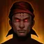

# Основы {#essentials}

   
Еда на ману и скорость атаки «Ивентовая еда» <strong>обязательны</strong>, чтобы играть в «Остаточной энергии» как задумано.

{: .food-option-icon }

Филейный стейк с грибами

или

{: .food-option-icon }

Сливочный отборный кролик

или

{: .food-option-icon }

Благословение Азены
{ .food-option-tag }

или

{: .food-option-icon }

Томатная фаршированная рыба

+

{: .food-option-icon }

Ивентовая еда

АльтернативаМожно снизить расход маны ценой небольшой потери DPS, сэкономив золото и отказавшись от еды на ману!

| Где | Что менять |
|---|---|
| «Экспансия» А.Р.К. | Берите «Запретное знание» вместо «Исключительный дар» (только для неважного контента) |
| «Прогресс» А.Р.К. | Стремительное восстановление 3 / Божественное вдохновение 3 / Пробужденное сознание 1 ★ |
| Плащ клинков | руна «Легендарный Марх» (только для более лёгких билдов с избытком генерации сфер) |

СоветыКороткая база о блейде

- Всем билдам Клинка смерти нужен питомец, дающий бонус к «Мастерству» (160).
- Порог для 333 — **1818** Мастерства (для оптимального набора шариков), но старайся выжать **1830+**.
- Оптимизируйте свою Созвездия А.Р.К. и подберите браслеты/снаряжение — [здесь!](../resources.md#ark-passive-calculator)
- Всегда жмите следующее умение во время анимации текущего умения.
- Если сомневаетесь, берите «Титаноборец» и «Бесшумный убийца»/«Адреналин» в качестве гравировок Фетранита.
- Для тренировок в Тризионе нужны гравировки «Стремительность» и «Источник маны» максимального уровня.
- «Изнурительные тренировки 1» помогут сгладить просадку урона на низких уровнях самоцветов.

## Сравнение билдов {#build-comparison}

<!-- This table and its two-build overlay picker are entirely driven by
     javascripts/build-data.js (window.DB_BUILD_DATA) - nothing to edit here.
     Go there to change a build's numbers, its short compare-table blurb, or
     whether it's eligible for the overlay picker. -->

## Гравировки {#engravings}

Всегда экипировать
Титаноборец
Адреналин
Бесшумный убийца
Неутомимый натиск

Выбери 1
выбери одного из двух ниже ↓

Моргенштерн

★ Рекомендуемая
Безопасный выбор
Ставь если выше 85% шанса крита

**Плюсы:**{: .best-for } Примерно на 1% сильнее гравировки «Голем» в поздней игре, но стоит дороже.

**Минусы:**{: .tradeoff } Зависит от уровня гравировки «Адреналин».

Голем

Альтернатива

**Плюсы:**{: .best-for } Дешёвый.

**Минусы:**{: .tradeoff } Эффективность исцеления уменьшается на 25%.

## Геймплей {#gameplay}

### Классовое умение (Z)

-   **Заполнение сфер** обычные умения заполняют сферы воли при попадании.
-   **Концентрация воли** нажми (Z) с 1 и более сферами, чтобы потратить их и активировать умение.

### Баффы классового умения

-   **+12%** скорости атаки
-   **+12%** скорости передвижения
-   **14/28/42%** силы атаки
-   **15/25/45%** восстановления маны
-   **10/30/50%** сокращения перезарядки

Применяй «Концентрацию воли» с 3 сферами — это даёт самые сильные баффы и сокращение перезарядки.

### Групповые синергии {#party-synergies}

-   **Иссечение** +4% исходящего. Атаки со спины и в голову наносят ещё +5%.
-   **Плащ клинков** +12.8% скорости атаки и передвижения на 6 сек.

### Стиль игры {#playstyle}

Остаточная энергия — это непрерывный цикл:

1. Набор шаров
2. 3 сферы
3. Концентрация воли (Z)
4. Повтор

Сокращение перезарядки — основа этого стиля: Перезарижай умения, чтобы накопить следующие 3 сферы.

Старайся держать стабильный аптайм «Плаща клинков», не гонись за попаданиями в спину, но и не забывай, что попадания в спину тоже важны — ты должен понимать, чем можешь не попадать. Используй «Концентрацию воли» в том числе чтобы телепортироваться за спину.

## Скилы остаточной энергии {#remaining-energy-skills}

<!-- Per-row id (name auto-resolves from skill-names.js) - full schema is in
     javascripts/essentials-table.js's
     "EASY EDIT GUIDE" comment. Tags, Notes, and the small italic value
     lines under each name are NOT authored here: they come from
     skill-data.js, so this table, every build page's Skill Setup card,
     and every tooltip that names the skill stay in sync automatically -
     edit a tag/note/line there, not here. -->

Урон
Вспомогательный
Иммунитет
Предупреждение

