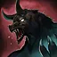
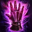

# 222 Ускоренный 🐆

<div class="build-card-row" markdown>
<div class="build-card" markdown>

<!-- Difficulty/Trixion/Playstyle stats above, AND the pentagon badge below,
     both read from javascripts/build-data.js (window.DB_BUILD_DATA) - there is
     nothing to hand-edit in either div itself. Find this build by its
     data-build id there and edit pentagon/difficulty/trixion/bestFor/etc.;
     the stat row, the pentagon badge, and the essentials.md comparison table
     all update together from that one place. -->
<div class="build-stats" data-build="222-speedy" data-family="surge"></div>

**Кому подходит:**{: .best-для } Тем, кому нужно что-то простое для старта, но сложное для освоения.

- Простая ротация, для понимания. Но тяжёлая в реализации.
- Множество <span class="skill-mention" data-glossary-id="pushimmunity">иммунитетов к отбросу</span>, а так же всегда есть запас стаков.
- Нуждается в малом количестве самоцветов. «Концентрация воли» и «Убийственная сталь» основа твоего урона.

</div>
<div class="pentagon-badge" data-build="222-speedy" data-family="surge" markdown>
<div class="pentagon-badge-title">Профиль билда</div>
<div class="pentagon-svg-mount"></div>
<div class="pentagon-badge-extra" markdown>
[Видео-гайд](https://www.youtube.com/watch?v=3PO1iSO8g50){ .video-chip } [Геймплей](https://www.youtube.com/watch?v=JQISLdCtXjQ){ .video-chip }
</div>
</div>
</div>

## Код билда {#skill-codes}

<!-- Paste the exported skill-code string (from the in-game loadout share
     feature) into the fenced code block below. Each `=== "Tab Name"` block is
     a separate tab holding its own code + optional italic note above it -
     copy that pattern to add another import option (e.g. an easier variant). -->

<div class="setup-panel" data-accent="lavender" markdown>
<div class="setup-notes" markdown>

<details class="setup-note" data-kind="danger" open markdown>
<summary><span class="setup-note-tag">Внимание</span>Перед импортом<span class="setup-note-arrow"></span></summary>

Убедись, что прочитал [Основы](essentials.md) перед импортом! Самоцветы сравни с гайдом ([Самоцветы](#gems)).

</details>

</div>
</div>

=== "222 Ускоренный"

    ```
    921BE17D25362FCFE8E928C54EA0C16120543073CD898B0CD4B3471ECE3EC6F89D211CCCB6167A00594B98D61F9DE491E6EAF79853D19F8DCBE515CD1429430D
    ```

## Система А.Р.К. {#ark-setup}

<!-- ark-passives / ark-cores JSON below use the site-wide node/core id
     vocabulary - each ark-passives node only needs its id + invested level,
     tier/max/name/icon all resolve from ap-node-names.js. Full schema is
     documented in javascripts/ark-passive-tree.js and ark-core-badge.js's
     "EASY EDIT GUIDE" comments. A nested "Alt" details block (e.g. an
     easier/optional variant) can carry its own compact ark-passives/
     skill-setup pair for that alternative - copy the existing pattern
     rather than editing the main tree in place. -->

<div class="setup-panel" data-accent="lavender" markdown>

<div class="ark-passives" data-family="surge" markdown>
<script type="application/json">
[
    { "id": "evolution", "nodes": [
      { "id": "crit", "level": 10 },
      { "id": "specialization", "level": 30 },
      { "id": "keensense", "level": 2 },
      { "id": "limitbreakevo", "level": 1 },
      { "id": "strike", "level": 2 },
      { "id": "master", "level": 1 },
      { "id": "pulverize", "level": 1 },
      { "id": "standingstriker", "level": 2 }
    ] },
    { "id": "enlightenment", "nodes": [
      { "id": "surgeenhancement", "level": 1 },
      { "id": "orbcompression", "level": 3 },
      { "id": "orbcontrol", "level": 1 },
      { "id": "limitbreakenl", "level": 3 },
      { "id": "chaosinfusion", "level": 1 },
      { "id": "chaoticpower", "level": 3 }
    ] },
    { "id": "leap", "nodes": [
      { "id": "awakeningamplifier", "level": 1 },
      { "id": "unleashedpower", "level": 5 },
      { "id": "releasepotential", "level": 3 },
      { "id": "instantspell", "level": 3 },
      { "id": "danceofscreams", "level": 3 }
    ] }
  ]
</script>
</div>

<div class="ark-cores" data-family="surge" markdown>
<script type="application/json">
[
  { "core": "sun", "label": "Slaughter Spectacle", "points": 0 },
  { "core": "moon", "label": "Twin Swords Dance", "points": 0 },
  { "core": "star", "label": "Swift Resolution", "points": 1 }
]
</script>
</div>

<div class="setup-notes" markdown>

<details class="setup-note" data-kind="tip" open markdown>
<summary><span class="setup-note-tag">Советы</span>Советы по А.Р.К.<span class="setup-note-arrow"></span></summary>

- Используй [Калькулятор Созвездий А.Р.К.](../resources.md#ark-passive-calculator), чтобы оптимизировать вкладку «Экспансию».

</details>

</div>

</div>

## Гравировки {#engravings}

<div class="setup-panel" data-accent="lavender" markdown>

<div class="engraving-loadout engraving-loadout-fixed" markdown>
<span class="engraving-chip" data-skill-id="grudge">Титаноборец</span>
<span class="engraving-chip" data-skill-id="adrenaline">Адреналин</span>
<span class="engraving-chip" data-skill-id="ambushmaster">Бесшумный убийца</span>
<span class="engraving-chip" data-skill-id="raidcaptain">Неутомимый натиск</span>
<span class="engraving-chip" data-skill-id="massincrease">Карающая длань</span>
</div>

<p class="engraving-loadout-hint engraving-loadout-hint-line" markdown>Подробнее о гравировках можно прочитать [здесь!](essentials.md#engravings)</p>

</div>

## Набор навыков {#skill-setup}

<!-- Full skill-setup schema (id/level/tripods/rune/subtitle/picks) is in
     javascripts/skill-setup.js's "EASY EDIT GUIDE" comment. Names, icons, and
     tags resolve automatically by id from skill-data.js - only add "name" to
     override the display text for a genuine one-off case. -->

<div class="setup-panel" data-accent="lavender" markdown>

<div class="skill-setup" data-family="surge" markdown>
<script type="application/json">
[
  {"id": "surpriseattack", "level": 13, "tripods": [1, 1, 1], "rune": {"tier": "legendary", "name": "Rage"}},
  {"id": "windcut", "level": 14, "tripods": [3, 3, 1], "rune": {"tier": "legendary", "name": "Galewind"}},
  {"id": "upperslash", "level": 11, "tripods": [2, 3, 2], "rune": {"tier": "epic", "name": "Galewind"}, "picks": ["Руна: Фиолетовый Агель или Легендарный Ульд — оба варианта равноценны."]},
  {"id": "bladedance", "level": 14, "tripods": [1, 1, 2], "rune": {"tier": "legendary", "name": "Galewind"}},
  {"id": "spincutter", "level": 10, "tripods": [3, 3, 1], "rune": {"tier": "epic", "name": "Galewind"}},
  {"id": "earthcleaver", "level": 10, "tripods": [3, 3, 2], "rune": {"tier": "legendary", "name": "Vision"}},
  {"id": "turningslash", "level": 14, "tripods": [1, 3, 1], "rune": {"tier": "legendary", "name": "Poison"}},
  {"id": "maelstrom", "level": 10, "tripods": [3, 1, 2], "rune": {"tier": "legendary", "name": "Bleed"}},
  {"id": "deathtrance", "subtitle": "Identity"},
  {"id": "deathlyslash", "subtitle": "Technique"},
  {"id": "bladeassault", "subtitle": "Awakening"},
  {"id": "surge", "subtitle": "Identity"}
]
</script>
</div>

<div class="setup-notes" markdown>

<details class="setup-note" data-kind="tip" open markdown>
<summary><span class="setup-note-tag">Советы</span>Руны<span class="setup-note-arrow"></span></summary>

- Используй <span class="skill-mention" data-rune-name="Purify">Солум</span> на «Хитроумном финте/Двуручный хват», для снятия негативных эффектов.
- Используй <span class="skill-mention" data-rune-name="Focus" data-rune-tier="legendary">Легендарный Марх</span> на «Плаще клинков», если проблемы с маной.

</details>

<details class="setup-note" data-kind="example" open markdown>
<summary><span class="setup-note-tag">Альтернатива</span>Выбор мобильности и контртаки<span class="setup-note-arrow"></span></summary>

<div class="engraving-loadout engraving-loadout-choice" markdown>
<div class="engraving-loadout-group" markdown>
<span class="engraving-loadout-label">Мобильность</span>
<span class="engraving-chip" data-skill-id="spincutter"><span class="engraving-chip-head">Разрубающие лезвия<span class="engraving-chip-level">Ур. 10</span></span><span class="engraving-chip-chips"><span class="tripod-chip tripod-t1">3</span><span class="tripod-chip tripod-t2">3</span><span class="tripod-chip tripod-t3">1</span><span class="rune-chip rune-epic rune-chip-tile" data-rune-name="galewind" data-rune-tier="epic"><span class="rune-chip-tile-box"></span><span class="rune-chip-label">Агель</span></span></span></span>
<span class="choice-or">ИЛИ</span>
<span class="engraving-chip" data-skill-id="darkaxel"><span class="engraving-chip-head">Аксель<span class="engraving-chip-level">Ур. 10</span></span><span class="engraving-chip-chips"><span class="tripod-chip tripod-t1">1</span><span class="tripod-chip tripod-t2">1</span><span class="tripod-chip tripod-t3">2</span><span class="rune-chip rune-epic rune-chip-tile" data-rune-name="galewind" data-rune-tier="epic"><span class="rune-chip-tile-box"></span><span class="rune-chip-label">Агель</span></span></span></span>
</div>
<div class="engraving-loadout-group" markdown>
<span class="engraving-loadout-label">Контртака</span>
<span class="engraving-chip" data-skill-id="headhunt"><span class="engraving-chip-head">Хитроумный финт<span class="engraving-chip-level">Ур. 4</span></span><span class="engraving-chip-chips"><span class="tripod-chip tripod-t1">1</span><span class="tripod-chip tripod-chip-empty" aria-hidden="true"></span><span class="tripod-chip tripod-chip-empty" aria-hidden="true"></span><span class="rune-chip rune-legendary rune-chip-tile" data-rune-name="vision" data-rune-tier="legendary"><span class="rune-chip-tile-box"></span><span class="rune-chip-label">Ульд</span></span></span></span>
<span class="choice-or">ИЛИ</span>
<span class="engraving-chip" data-skill-id="earthcleaver"><span class="engraving-chip-head">Двуручный хват<span class="engraving-chip-level">Ур. 10</span></span><span class="engraving-chip-chips"><span class="tripod-chip tripod-t1">3</span><span class="tripod-chip tripod-t2">3</span><span class="tripod-chip tripod-t3">2</span><span class="rune-chip rune-legendary rune-chip-tile" data-rune-name="vision" data-rune-tier="legendary"><span class="rune-chip-tile-box"></span><span class="rune-chip-label">Ульд</span></span></span></span>
</div>
</div>

</details>

</div>

</div>

## Самоцветы {#gems}

<!-- Ranked skill-id lists per column (dmg/cd), top = highest priority.
     Full schema, including the expandable "alts" form for a swappable
     alternative, is in javascripts/gem-priority.js's "EASY EDIT GUIDE"
     comment. -->

<div class="setup-panel" data-accent="lavender" markdown>

<div class="gem-priority" markdown>
<script type="application/json">[
  { "col": "dmg", "items": [
    { "id": "surge", "level": 10 },
    "bladedance",
    "turningslash",
    "windcut"
  ] },
  { "col": "cd", "items": [
    { "id": "maelstrom", "level": 10 },
    { "id": "upperslash", "level": 9 },
    { "id": "surpriseattack", "level": 9 },
    "bladedance",
    "windcut",
    "turningslash",
    { "id": "spincutter", "alts": [
      { "id": "surpriseattack", "note": "Бери «Урон» на «Внезапном выпаде», если предпочитаешь, или даже самоцвет другого класса Ур. 10." },
      { "id": "darkaxel", "note": "Бери, если решишь перейти на «Аксель»." }
    ] }
  ] }
]</script>
</div>

</div>

## Ротация {#rotation}

<!-- Each `.rotation-line` is a compact JSON step list of skill ids in
     order - names/icons resolve automatically, same id vocabulary as Skill
     Setup and Gems above. Full schema (situational steps, swapNext,
     cycleRef, trailing suffix, etc.) is in javascripts/rotation-line.js's
     "EASY EDIT GUIDE" comment. -->

Применяй «Разрубающие лезвия» (или «Аксель», если берёшь альтернативу), чтобы гарантированно попасть в спину «Убийственной сталью» и «Концентрацией воли».

Используй Открытие (по желанию), затем чередуй Цикл 1 и 2 до конца боя.

Открытие
{ .rotation-stage }

<div class="cycle-card" markdown>
<div class="cycle-card-header"><span class="cycle-title">Открытие с запасом стаков — 68 стаков</span></div>
<div class="rotation-line" markdown>
<script type="application/json">
["windcut", "deathtrance", "surpriseattack", "maelstrom", "windcut", "upperslash", "turningslash", "bladedance", "deathlyslash", "surpriseattack", "surge"]
</script>
</div>
</div>

Циклы
{ .rotation-stage }

<div class="cycle-card" markdown>
<div class="cycle-card-header"><span class="cycle-num cycle-num-1">1</span><span class="cycle-title">Цикл со скипом «Внезапного выпада» — 61 стаков</span></div>
<div class="rotation-line" markdown>
<script type="application/json">
["windcut", "deathtrance", "maelstrom", "surpriseattack", "windcut", "upperslash", "turningslash", "bladedance", "deathlyslash", "surge"]
</script>
</div>
</div>

<div class="cycle-card" markdown>
<div class="cycle-card-header"><span class="cycle-num cycle-num-2">2</span><span class="cycle-title">Цикл со скипом «Неумолимого притяжения» — 60 стаков</span></div>
<div class="rotation-line" markdown>
<script type="application/json">
["deathtrance", "surpriseattack","maelstrom", "windcut", "upperslash", "turningslash", "bladedance", "deathlyslash", "surpriseattack", "surge"]
</script>
</div>
</div>

<div class="rotation-notes" markdown>

1. Идеально чередование **1>2>1>2**, но по паттернам босса допустимы и варианты вроде **1>2>2>1** или **1>1>2>2**.
2. Кажется сложнее, чем есть: посмотри [это видео](https://www.youtube.com/watch?v=V1UQhE37Yjs), чтобы увидеть полный цикл в деле.

</div>

С нуля сфер
{ .rotation-stage }

<div class="rotation-notes" markdown>

1. Рекомендуется использовать <span class="food-req-item">{: .skill-icon } Мощную «Эйфорию»</span>, но если ты жадный и ленивый, переходи к #2.
2. Сгенерируй одну сферу, набери минимум 40 стаков, затем примени «Концентрацию воли» — она вернёт все 3 сферы.

</div>

Применение «Ардопина-Х»
{ .rotation-stage }

<div class="rotation-notes" markdown>

1. Используй <span class="food-req-item">{: .skill-icon } Ардопин-Х</span> прямо перед «Убийственной сталью» и умести две пары «Убийственная сталь» + «Концентрация воли» в 10 секунд.

</div>

{ .zoomable-image loading=lazy }

## Распределение Урона {#dps-spread}

<!-- data-labels / data-values / data-ids are three parallel comma-separated
     lists, ordered highest % first - update after a fresh Trixion recording
     or a balance pass. Full schema is in javascripts/dps-chart.js's
     "EASY EDIT GUIDE" comment. -->

<p class="dps-showcase-caption">Древние ядра, самоцветы полностью Ур. 10</p>

<div class="dps-showcase" markdown>
<div class="dps-showcase-frame" markdown>
<div class="dps-chart" data-show-icons data-values="47.8,35.5,7.1,3.2,2.4,0.8" data-ids="surge,deathlyslash,bladedance,turningslash,windcut,surpriseattack"></div>
</div>
</div>